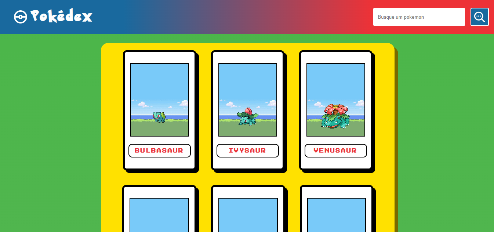

<h1 align="center">Welcome to Pokédex 👋</h1>

Projeto de uma pokédex usando o PokeAPI

Link de acesso =>https://pokedexgc.netlify.app/

##

## Ferramenteas utilizadas:
  - React, React Hooks, React Router Dom, React Icons;
  - Consumo da PokeAPI;
  - Projeto criado usando o VITE;
  - Funcionalidade de pesquisa;
  - AXIOS.
